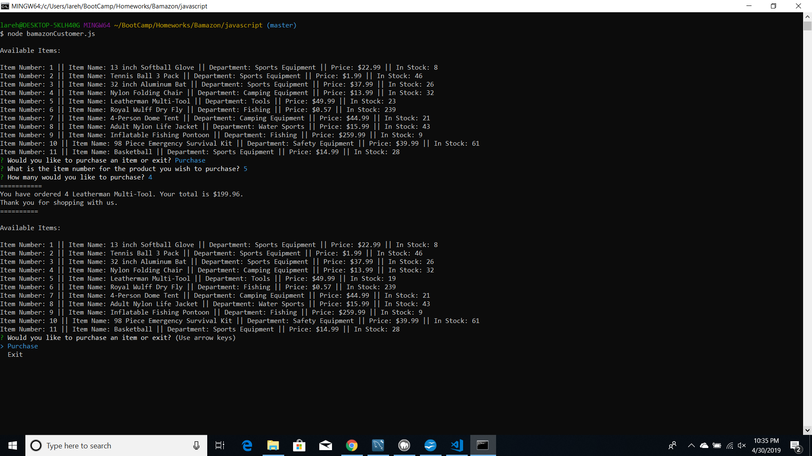
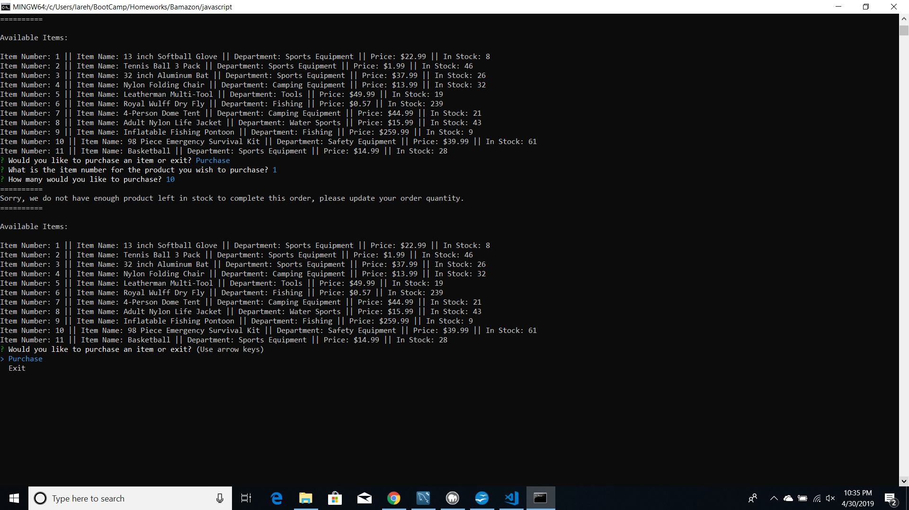
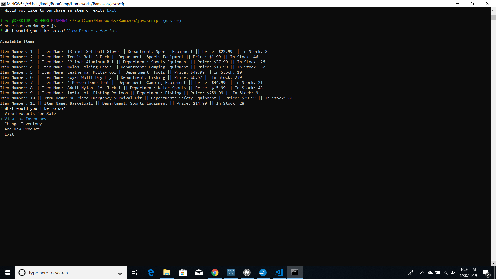
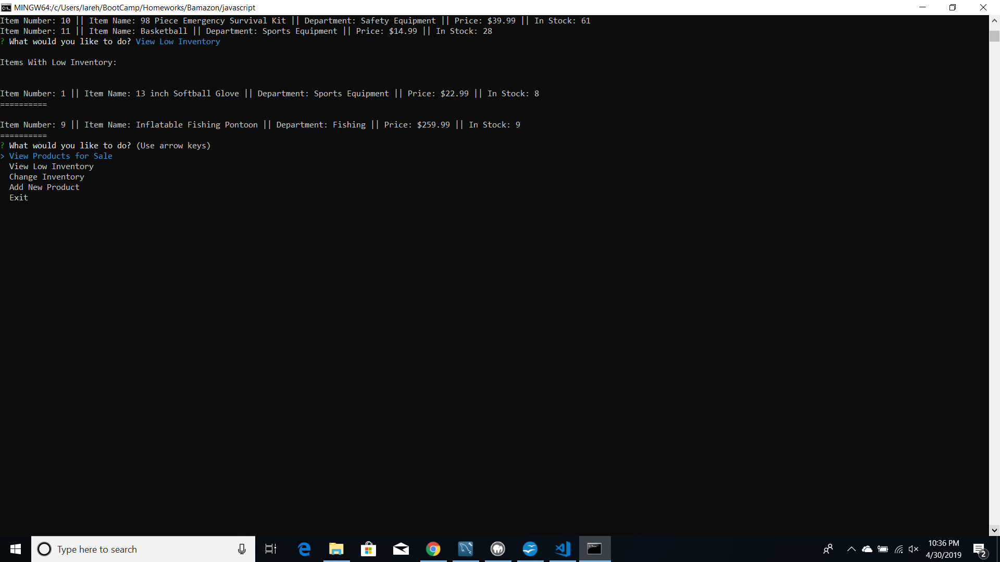
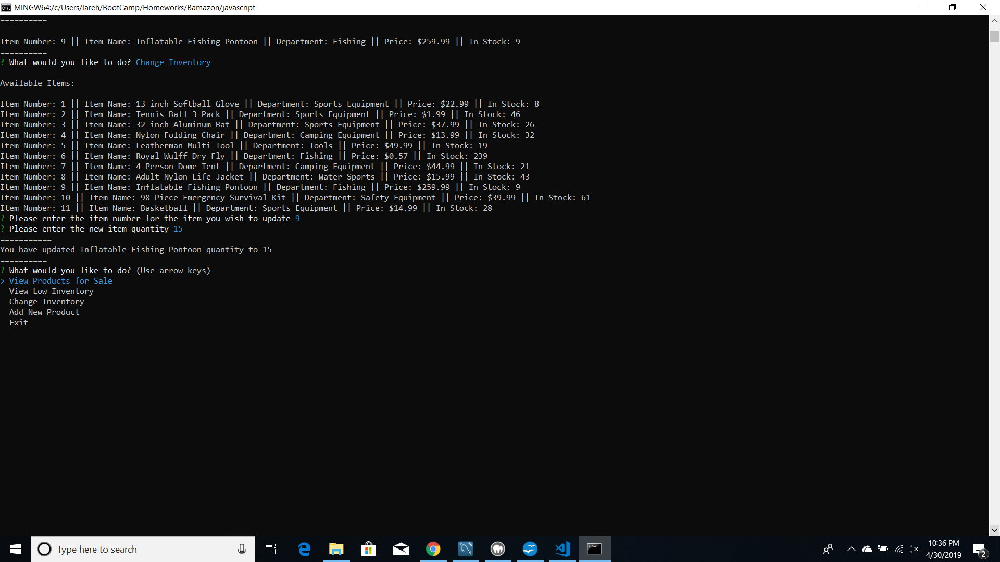
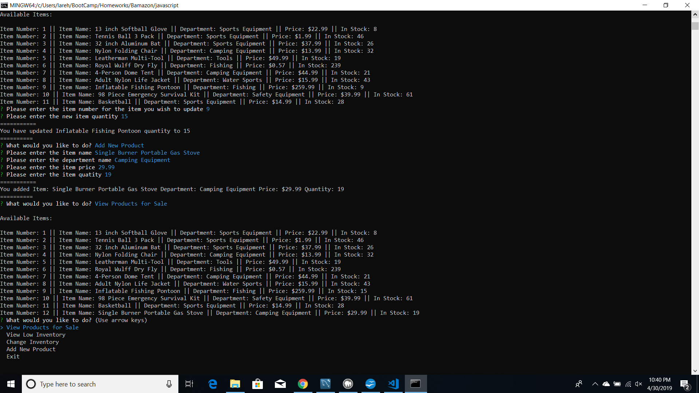

# Bamazon
Bamazon is an product ordering and inventory tracking app that runs in node. It has features designed for both customers as well as store managers.

**In order for Bamazon to run properly:** *After cloning the repository, you must supply your own .env file containing your Database host, port, root, user, password, and name. The schema.sql will need to be run in MySQL Workbench. You can either use the seeds.sql to populate your table or add your own products using the format in the seeds.sql file. You will also need to run npm install.*

## How to Use Bamazon as a Customer
Run the bamazomCustomer.js in node. The user will be asked whether they would like to purchase an item or exit and a list of all available items for sale will be displayed. This list shows the Item Number, Item Name, Department, Price and the Quantity in Stock. If exit is chosen app will disconnect from the database and exit node.

### Purchasing an Item

If the user chooses to make a purchase, they will be prompted to enter an item number and an order quantity. The app does validate the user's imput to ensure only a valid item number and quantity can be entered. Once item and quantity are validated, the app alerts the user what the item name and quantity purchased were, and displays the order's total price. The database item quantity is then updated to reflect the order and the available items are redisplayed along with the option to purchase again or exit.

### Insufficient Item Quantity

If a customer attempts to purchase a larger quantity of an item than is currently in stock, the app alerts them that there currently isn't enough inventory to complete the order and asks them to update their order. The available items are re-displayed with the option to purchase or exit.

## How to Use Bamazon as a Manager
Run the bamazonManager.js in node. The user will be asked what they would like to do. Available options are View Products for Sale, View Low Inventory, Change Inventory, Add New Product, or Exit. If the user chooses to exit, the app will disconnect from the database and exit node.

### View Products for Sale

If the user chooses to View Products for Sale, a list with the Item Number, Item Name, Department, Price and the Quantity in Stock will be displayed and the user will be asked to enter what they would like to do next.

### View Low Inventory

When View Low Inventory is chosen, the Item Number, Item Name, Department, Price, and Quantity in Stock will be displayed for all items with a quantity of 10 or less. The user will be asked what they would like do next.

### Change Inventory

If the Change Inventory option is chosen, the list of available items is again displayed. The user will be asked to enter the item number for the item they wish to change and new quantity for the item. The app will validate the users input to ensure only a valid item number and quantity can be entered. Once the input is validated the user is alerted which item was updated and what the new quantity for the item is. The database is also updated with the new item quantity. The user is prompted to enter what they would like to do next.

### Add New Product 

If the user choose to Add New Product, they will be prompted to enter the new item name, department, price, and quantity. The app will verify user input and only allow a valid price and quantity to be entered. Once the input is validated the user is alerted with the new item name, department, price and quantity. The database is also updated with the new product information and the product will be displayed in the available items list when either the manager or customer chooses to view the list.

## Technologies Used
- NodeJS
- JavaScript
- npm mysql
- npm inquirer
- npm dotenv
- MySQL Workbench

## Author
Lara Eller